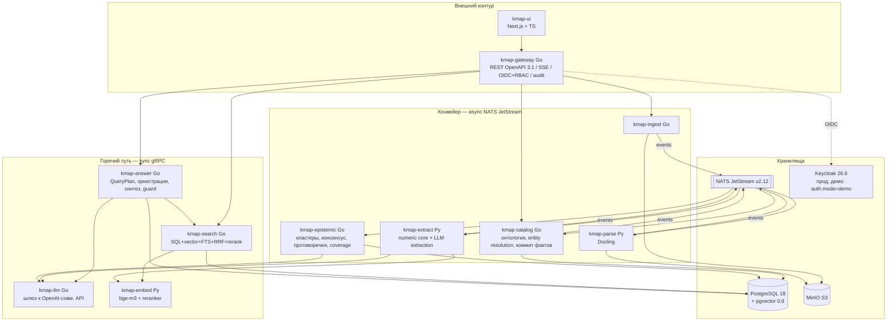

# 03. Целевая архитектура (v3)

Кодовое имя платформы: **kmap** (R&D Knowledge Map). Подход: «проверяемое числовое ядро + эпистемический слой» (обоснование выбора — [02-hypotheses.md](02-hypotheses.md)).

## 1. Принципы

1. **Детерминизм там, где цена ошибки высока.** Числа, единицы, операторы, фильтры — только детерминированный код. LLM — для сущностей, связей, привязки, синтеза, judge; всегда под JSON Schema и с последующей верификацией.
2. **Evidence-first.** Ни один факт без provenance (документ → чанк → span → цитата). Ответ не может содержать число, отсутствующее в evidence (numeric guard).
3. **Event-driven конвейер, синхронный поиск.** Ingestion — асинхронный через NATS JetStream (replay = переиндексация). Горячий путь ответа — синхронные gRPC-вызовы без брокера.
4. **Один стор — PostgreSQL.** Вектор, граф (рёбра+CTE), FTS, JSONB, реляционка — в одной ACID-базе. Специализированные БД — за интерфейсами, включаются по порогам (§7).
5. **Чистая архитектура + DDD.** Каждый Go-сервис: `domain` (сущности, инварианты) ← `app` (use-cases) ← `ports` (gRPC/HTTP хендлеры) / `adapters` (PG, NATS, S3). Зависимости — только внутрь.
6. **Graceful degradation.** Отказ LLM/embeddings/брокера снижает качество, но не роняет функцию (§6).
7. **Экономия ресурсов** (критерий жюри): маленькие модели по умолчанию, кэширование, отсутствие LLM в горячем пути структурных запросов.

## 2. Bounded contexts (DDD)

| Контекст | Ответственность | Сервисы | Ключевые агрегаты |
|---|---|---|---|
| **Ingestion** | приём, реестр и версии документов, статусы конвейера | kmap-ingest | Document, DocumentVersion, IngestJob |
| **Parsing** | документ → DocIR (структурированное представление) | kmap-parse (Py) | DocIR |
| **Extraction** | кандидаты фактов: числа (детерм.), сущности/связи (LLM), чанки, эмбеддинги | kmap-extract (Py), kmap-embed (Py) | ExtractionBundle |
| **Catalog / Ontology** (core domain) | канонические сущности, алиасы, единицы, entity resolution, коммит фактов, экспертные правки | kmap-catalog | Entity, Alias, UnitDef, ParameterDef, NumericFact, Claim, Edge |
| **Epistemic** | кластеры сопоставимости, консенсус, противоречия (judge), coverage/gaps, профили экспертов | kmap-epistemic | Cluster, Consensus, Contradiction, CoverageCell, ExpertProfile |
| **Retrieval & Answering** | понимание запроса, гибридный поиск, ранжирование, синтез, guard, кэш | kmap-search, kmap-answer | QueryPlan, EvidencePack, AnswerDoc |
| **LLM Access** | единый шлюз к OpenAI-совместимым upstream'ам, схемы, ретраи, бюджеты, кэш | kmap-llm | LLMTask |
| **Identity & Access** _(устаревшее требование ТЗ — demo-режим as-is, ADR-6)_ | OIDC-аутентификация, RBAC, уровни доступа документов, аудит | kmap-gateway + Keycloak (прод) / `auth.mode: demo` (демо) | Principal, Grant, AuditRecord |
| **Evaluation** | gold-set, регрессионные прогоны, метрики | kmap-eval (Py) | GoldQuestion, EvalRun |

Карта контекстов: Catalog — **core domain**, все пишут факты только через него (единая точка инвариантов). Extraction → Catalog: conformist (схема кандидатов задаётся Catalog). Retrieval → Catalog/Epistemic: read-only через реплики.

## 3. Топология сервисов



Плюс вне контура: **kmap-eval** (Python, офлайн/CI), **kmap-notify** (Go, Phase 2: подписки/уведомления), стек наблюдаемости (OTel Collector, Prometheus, Grafana, Loki, Tempo).

## 4. Технологический стек (зафиксировано, версии на июль 2026)

| Слой | Выбор | Версия | Обоснование |
|---|---|---|---|
| Язык backend | Go | тулчейн 1.25.x; в `go.mod` строго `go 1.25.0` | требование заказчика; низкая латентность, дешёвый рантайм; линт — golangci-lint c `modernize` ([16-dev-environment.md](16-dev-environment.md)) |
| Язык ML-сервисов | Python | 3.13 (uv) | экосистема Docling/трансформеров |
| REST-контракты | swag (swaggo) **v2** | `github.com/swaggo/swag/v2`, OpenAPI **3.1** | требование: OpenAPI-генерация через swaggo последней версии; v2 генерирует OAS 3.1 из аннотаций |
| HTTP-фреймворк | chi | v5 | минимализм, совместимость со swag-аннотациями |
| Внутренний RPC | gRPC + buf | grpc-go 1.7x, buf v1 (lint + breaking check в CI) | contract-first, кодоген, обратная совместимость контрактов |
| Шина событий | **NATS JetStream** | сервер ≥2.12 | см. §5 — выбор против Kafka |
| СУБД | **PostgreSQL** | 18 (async I/O, `uuidv7()`) | один ACID-стор: реляционка+вектор+граф+FTS+JSONB; async I/O ускоряет seq-scan/vacuum |
| Векторный поиск | pgvector | 0.8.x (HNSW, iterative index scans, halfvec) | iterative scans решают «фильтр + KNN» без overfiltering |
| Объектное хранилище | MinIO | актуальный RELEASE | S3-совместимость (готовность к корп. S3), blob'ы документов/DocIR/bundle |
| Парсинг документов | Docling | 2.x (актуальная 2.10x) | PDF/DOCX/XLSX/HTML; TableFormer для таблиц; reading order; Apache 2.0; OCR — опция |
| Эмбеддинги | BAAI/bge-m3 | — | 1024d, 8192 токенов, 100+ языков, dense+sparse; единое RU/EN пространство |
| Реранкер | BAAI/bge-reranker-v2-m3 | — | кросс-языковой rerank топ-50 |
| Единицы измерения | Pint | 0.25.x | реестр единиц + кастомные RU-определения; перевод в SI |
| LLM-провайдер | **Yandex AI Studio** (Responses API, OpenAI-совместимый, схема `Api-Key`, `ai.api.cloud.yandex.net`, ключ владельца); эмбеддинги/rerank — DigitalOcean Gradient; альтернатива — vLLM on-prem | — | ограничение хакатона: **только open-weight** (allowlist в llm-routes; `yandexgpt`/`aliceai` и проприетарные модели запрещены) |
| Модели LLM | `gpt-oss-20b/latest` — extraction/parse_query/bind; `deepseek-v4-flash/latest` — синтез; `gpt-oss-120b/latest` — judge/эскалации; `qwen3.6-35b-a3b/latest` — алиасы | матрица — [06-extraction.md](06-extraction.md) §2.1 | «чем меньше модель при том же качестве — тем лучше» (критерий жюри) |
| IAM _(deprecated)_ | Keycloak (OIDC/JWT) — прод; `auth.mode: demo` (статические токены-роли) — демо | 26.6.x | **устаревшее требование ТЗ** (эксперты: не реализовывать); минимальный контур собран рано, оставлен в demo-режиме as-is, без развития (ADR-6) |
| Frontend | Next.js + React + TS, Tailwind, shadcn/ui, Cytoscape.js, TanStack Table | актуальные | из RFC; Cytoscape для ego-графа |
| Наблюдаемость | OpenTelemetry (traces+metrics+logs) → Prometheus, Grafana, Loki, Tempo | — | сквозной trace REST→gRPC→NATS |
| Миграции | golang-migrate (SQL-first; `migrate` CLI + embed через iofs) | v4 | простота; postgres-драйвер сам берёт advisory lock — безопасен при параллельном старте |
| Конфигурация | **только YAML**: `configs/base/*.yml` + оверлей `configs/<env>/` + `configs/secrets.yml` (merge последним; в .gitignore, шаблон — `secrets.yml.example`) — koanf v2 в Go, pydantic-settings в Python | — | конфиг ревьюится как код; env-переменные и `.env` не используются вовсе; валидация при старте (fail-fast) |
| Деплой | Docker Compose v2 на одной Ubuntu VM (8 vCPU/32 ГБ): systemd, caddy TLS, бэкапы офф-VM; **без k8s** (отложенный путь масштабирования) | — | [12-deployment.md](12-deployment.md) |

## 5. Ключевые архитектурные решения (ADR-конспект)

### ADR-1. NATS JetStream, а не Kafka
**Контекст:** конвейер документов (пики: сотни документов/час; события: ~10⁵/день), нужны durable-очереди, retry, DLQ, replay для переиндексации.
**Решение:** NATS JetStream ≥2.12.
**Почему:** (а) объёмы на 2–3 порядка ниже зоны, где Kafka незаменима; (б) экплуатационно легче: один бинарь, кластер из 3 узлов, K/V и Object store бонусом; (в) нативный Go; (г) в 2.11–2.12 закрыты нужные нам паттерны: consumer priority groups, pause, **atomic batch publish**, scheduled messages (отложенные ре-попытки DLQ); (д) exactly-once-ish через `Nats-Msg-Id` дедупликацию + идемпотентные консьюмеры.
**Плата:** меньше корпоративной инерции, чем у Kafka; ecosystem-коннекторов меньше. Компенсация: весь I/O брокера — за интерфейсом `EventBus`; миграция на Kafka — замена адаптера, контракты CloudEvents не меняются.

### ADR-2. Один PostgreSQL вместо Neo4j+Qdrant+PG
Подтверждено экспериментом E6 (см. [02-hypotheses.md](02-hypotheses.md)): p95 гибридного запроса 380 мс, CTE 3-hop 120 мс на масштабе НФТ (1M сущностей). ACID между фактом, ребром и статусом валидации — критично для KR-3 (никаких двухфазных согласований между сторами). Один контур HA/бэкапа/PITR.

### ADR-3. LLM никогда не в горячем пути структурных операций
Разбор запроса: LLM со схемой, но с **rule-based fallback** (словарь сущностей + тот же числовой парсер на строке запроса) — при недоступности LLM структурные запросы продолжают работать. Синтез — стримится после отдачи evidence (пользователь видит факты раньше «литературной» части).

### ADR-4. Claim-check для тяжёлых полезных нагрузок
События NATS несут только ссылки (`docir_uri`, `bundle_uri` в MinIO) + контрольные суммы. Лимит сообщения 1 МБ, DocIR больших PDF — десятки МБ.

### ADR-5. Транзакционный outbox
Каждый сервис, публикующий события после записи в PG, пишет их в `ops.outbox` в той же транзакции; relay-горутина публикует с `Nats-Msg-Id = outbox.id` (дедуп на стороне JetStream). Никаких «записал в БД, но не опубликовал».

### ADR-6. Авторизация: устаревшее требование ТЗ — demo-режим as-is, без развития (пересмотр по Q&A экспертов, 04.07.2026)
Первоначально (02.07) раздел «Управление доступом» из раннего описания ТЗ трактовался как обязательный и был реализован в минимальном виде. **На всех Q&A трека (03–04.07) эксперты явно и неоднократно подтвердили: это устаревшее требование, реализовывать НЕ нужно, в актуальной версии описания задачи пункта нет, на оценку не влияет.** Решение: уже собранный минимальный контур **оставляем как есть в demo-режиме** (`auth.mode: demo` — статические токены-роли + RLS-уровни доступа документов `public/internal/confidential/restricted` + аудит мутаций) — он стабилен и дёшев в поддержке, но **дальнейших вложений нет, в демо/питче не акцентируется, дифференциатором не позиционируется**. Что именно собрано — описано в [11-nfr.md](11-nfr.md) §4.1 как факт кода, а не как приоритет. Контур не связан с ядром: числа/provenance/эпистемика/качество ответов от него не зависят, и при желании владельца его можно целиком отключить, не затрагивая ядро.

## 6. Уровни деградации

| Отказ | Поведение | Что теряем |
|---|---|---|
| LLM upstream недоступен | fallback-парсер запроса; ответ = структурный: факты, таблицы, консенсус, эксперты, без «литературного» синтеза; ingestion: числовое ядро работает, LLM-extraction откладывается в очередь (retry с backoff) | стилистика ответа, новые LLM-сущности |
| kmap-embed недоступен | retrieval = FTS + SQL-фильтры (без вектора и rerank) | семантическая полнота |
| NATS недоступен | поиск/ответы работают (sync-путь без брокера); загрузка принимается, события копятся в outbox | свежесть индекса |
| Контейнер PG упал | `restart: unless-stopped` + WAL-recovery ≤1–2 мин; retry на клиентах | пауза записи/чтения на время рестарта |
| Пик нагрузки | реплики stateless-сервисов (compose scale); rate-limit на gateway; приоритет sync-пути над batch (отдельные PG-пулы, cpus-лимиты фоновых) | латентность batch |

## 7. Пороги пересмотра решений (записаны заранее)

| Сигнал | Действие |
|---|---|
| p95 обходов графа > 1 с при глубине ≥4 или рёбер > 50M | вынести граф в Memgraph/Neo4j за интерфейсом `GraphRepo` |
| p95 KNN > 500 мс при > 20M векторов или recall HNSW < 0.9 | выделенный Qdrant за интерфейсом `VectorRepo` |
| событий > 10⁷/день или нужны внешние потребители потока | миграция EventBus на Kafka |
| > 30% документов — сканы без текстового слоя | включить OCR-профиль Docling + GPU-пул |

## 8. Потоки данных (сквозные)

### 8.1. Ingestion (документ → знания)
```
UI/API → gateway → ingest: файл в MinIO, sha256-дедуп, versия, ops.outbox
→ [kmap.doc.v1.registered] → parse: Docling → DocIR в MinIO
→ [kmap.doc.v1.parsed] → extract: чанки+эмбеддинги; numeric core (детерм.);
  LLM entities/relations/conclusions; ExtractionBundle в MinIO
→ [kmap.doc.v1.extracted] → catalog: entity resolution (алиасы+trgm+вектор),
  валидация единиц/диапазонов, транзакционный коммит фактов/рёбер/чанков, outbox
→ [kmap.facts.v1.committed] → epistemic: инкрементальный пересчёт затронутых
  кластеров, консенсус, кандидаты противоречий → judge → coverage/expert profiles
→ [kmap.epistemic.v1.updated] → notify (Phase 2), инвалидация кэша ответов
```
Полное описание этапов, идемпотентности и повторов — [05-ingestion.md](05-ingestion.md).

### 8.2. Query (вопрос → ответ)
```
UI → gateway (SSE) → answer:
  1) QueryPlan: LLM-parse со схемой | rule-based fallback (≤50 мс)
  2) search: SQL-факты (numrange && SI) ∥ pgvector top-200 ∥ FTS → RRF → rerank top-50
  3) EvidencePack: факты + чанки + консенсус/противоречия/пробелы кластеров + эксперты
  4) стрим: сначала evidence-блок, затем LLM-синтез с цитатами
  5) numeric guard: все числа ответа сверены с evidence; нарушение → регенерация → экстрактивный fallback
```
Бюджет латентности и детали — [07-query-pipeline.md](07-query-pipeline.md).

### 8.3. «Новые связи при расширении базы» (KR-7)
Каждый новый документ автоматически: линкуется к существующим каноническим сущностям (E-resolution), пополняет кластеры сопоставимости, будит пересчёт консенсуса/противоречий/coverage только затронутых ключей (`cluster-dirty` события), инвалидирует кэш ответов по затронутым сущностям. Ночной полный пересчёт — страховка от дрейфа инкрементов.

## 9. Структура кода: один Go-проект, много точек входа

Весь Go-бэкенд — **единый Go-модуль** (`go.mod` в корне, `go 1.25.0`). «Микросервисность» — в bounded contexts и отдельных деплой-единицах, а не в множестве модулей: один бинарь = одна папка в `cmd/`, один контекст = пакет в `internal/`.

```
go.mod                             # ЕДИНЫЙ модуль: github.com/<org>/kmap
cmd/                               # точки входа (по бинарю на сервис)
├── gateway/main.go                # DI-сборка своего контекста, конфиг, graceful shutdown
├── ingest/main.go  catalog/main.go  llm/main.go
├── search/main.go  answer/main.go   epistemic/main.go
internal/
├── catalog/                       # bounded context (эталон слоёв)
│   ├── domain/                    # ЧИСТЫЙ домен: Entity, NumericFact, инварианты,
│   │   └── resolution/            # доменные ошибки; без внешних зависимостей
│   ├── app/                       # use-cases (CommitExtraction, MergeEntities...),
│   │                              # порты как интерфейсы
│   ├── ports/
│   │   ├── grpc/                  # gRPC-хендлеры (сген. сервер + маппинг)
│   │   └── consumer/              # NATS-консьюмеры (тоже порт входа)
│   └── adapters/
│       ├── pg/                    # репозитории (sqlc/pgx), outbox
│       ├── nats/  s3/  llmgw/     # EventBus, blob, клиент kmap-llm
├── gateway/  ingest/  llm/  search/  answer/  epistemic/   # те же слои
└── platform/                      # общее: events (CloudEvents), otel, pgx, config, outbox
Dockerfile                         # ОДИН на все Go-сервисы: multi-stage alpine,
                                   # ARG SERVICE → go build ./cmd/${SERVICE}; nonroot
```

Правила: домен не знает про pgx/NATS/proto — маппинг только в адаптерах; **контексты не импортируют друг друга** (только `internal/platform` и сгенерированные контракты из `contracts/`) — взаимодействие исключительно через gRPC/события, это сохраняет вырезаемость сервиса в отдельный модуль при будущем масштабировании. Кросс-контекстные импорты ловит линтер (depguard-правило в `.golangci.yml`).

## 10. Мультиязычность (RU/EN + китайский/испанский)

Корпус Гипроникеля — RU/EN/китайский/испанский; вектор bge-m3 (100+ языков) — кросс-языковой хребет для всех четырёх, FTS — усиление для тех, где у PG есть конфиг.

- bge-m3 — единое кросс-языковое векторное пространство: русский запрос находит английский (и китайский/испанский) документ без перевода.
- FTS: generated-столбцы `tsv_ru` (config `russian`) и `tsv_en` (config `english`), поиск по обоим с весами; испанский подключается конфигом `spanish` при необходимости; для китайского встроенного PG-конфига нет — опора на вектор (bge-m3) + trigram (`pg_trgm`).
- Канонические сущности: `canonical_name` (RU) + `canonical_name_en` + алиасы с указанием языка; словарь синонимов сеидится из YAML-справочников и пополняется LLM-предложениями со статусом `pending` (утверждает эксперт).
- Единицы: реестр маппит RU-написания («мг/дм³», «т/сут», «мас.%») в канонические SI через Pint-словарь.
